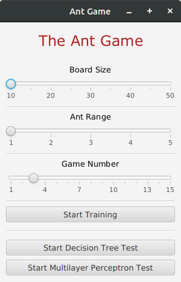
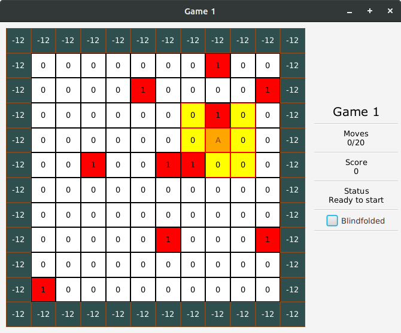
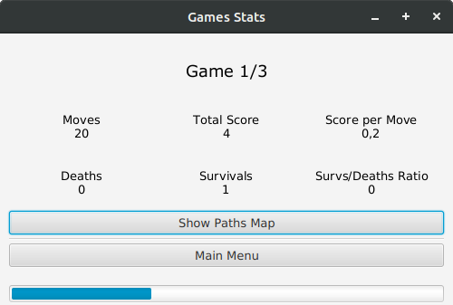
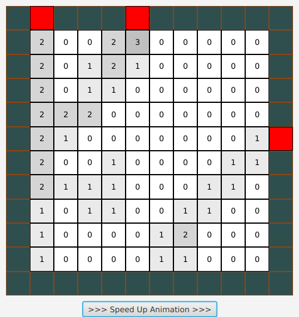

# The Ant Game
The Ant Game is an example of how Artificial Intelligence can be used to solve problems and take decisions based simply on experience.

## Concept
The main goal is to teach the Ant how to search food and not to go outside the board boundaries.\
This is accomplished by playing manually some games at first, in order to generate the training-set that the Ant will use to learn how to move; then this data-set is given in input to a classifier, that will build a model capable of deciding autonomously the direction to take based on the surrounding cells.

## Getting Started
You only have to clone this repository and run from the Launcher class.

The Main Menu will look like this:



Here you can choose board size, field of view of the Ant and total number of games to be played.

### Training
To begin with training, simply press the "Start Training" button. A new window will be displayed:



This is the Game Window, which includes:
- Gameboard
- Game number
- Moves counter
- Total score
- Ant status
- Blindfolded checkbox

The Ant is represented by an orange square with an A inside it, while its field of view is marked in yellow. If the "Blindfolded" box is not checked, you will see white boxes (empty space), red boxes (representing the food) and green boxes (the territory to avoid, outside the playing field); otherwise, all the cells outside the field of view are grayed out.

You can then move the Ant simply by using the arrow keys. Each move will be recorded in a `.arff` file (whose details are customizable in the Launcher class) together with a description of the Ant's surroundings, forming an entry of the data-set; to increase the quality of the training-set, each move is also rotated by 90°, thus generating 4 entries for each movement performed.

When the Ant dies or reaches the moves limit, press the "End Game" button that pops up on the right to go to the next game.

Additionally, from the Stats Window you can see at any time the overall statistics and an animated path map, useful to check the topological distribution of the moves performed.





When all training games have been played, press the "Main Menu" and go to the next section.

### Testing
After the training phase, the program should have generated an `.arff` file that looks like this:

```
@RELATION AntTrain

@ATTRIBUTE 0-0 REAL
@ATTRIBUTE 0-1 REAL
@ATTRIBUTE 0-2 REAL
@ATTRIBUTE 1-0 REAL
@ATTRIBUTE 1-2 REAL
@ATTRIBUTE 2-0 REAL
@ATTRIBUTE 2-1 REAL
@ATTRIBUTE 2-2 REAL
@ATTRIBUTE Direction {N,S,E,W}

@DATA
0,1,0,0,0,0,1,0,E
0,1,0,0,0,0,1,0,N
0,1,0,0,0,0,1,0,W
0,1,0,0,0,0,1,0,S
...
```
In this particular case the first 8 attributes represent the surroundings of the Ant, while the last one indicates the direction taken; the total number is obviously varying according to the parameters chosen initially in the Main Menu. This file will be now used to train a classifier, that will be able to choose which move to perform based on what what has been learned previously.

From the Main Menu select one between "Start Decision Tree Test" and "Start Multilayer Perceptron Test" according to the classifier you want to use: after a while (mainly depending on the size of the training set) a Game Window very similar to the one seen previously will open, and the Ant will begin to play autonomously. The flow will therefore be also similar to the one seen in the training phase, including stats and paths logging.

When all the simulations terminate, you can go back to the Main Menu and try another classifier: note that the test will be performed using the same gameboards, to ensure a fair performance comparison between different types.

## Libraries Used
- [Arff Generator](https://github.com/MircoRosa/arff-generator) - Used for `.arff` file generation
- [Weka](https://www.cs.waikato.ac.nz/ml/weka/) - The Machine Learning library used for model generation and move classification

## Authors
* [**Mirco Rosa**](https://github.com/MircoRosa) - Design and Development
* [**Stefano Volponi**](https://github.com/dinozof) - Design and Testing

#
**Disclaimer**: this game has been built for educational purposes, so undesired behaviours may occur if commands are not executed in the right order.

_This project has been developed for the "Artificial Intelligence" Master's Degree course @University of Parma._